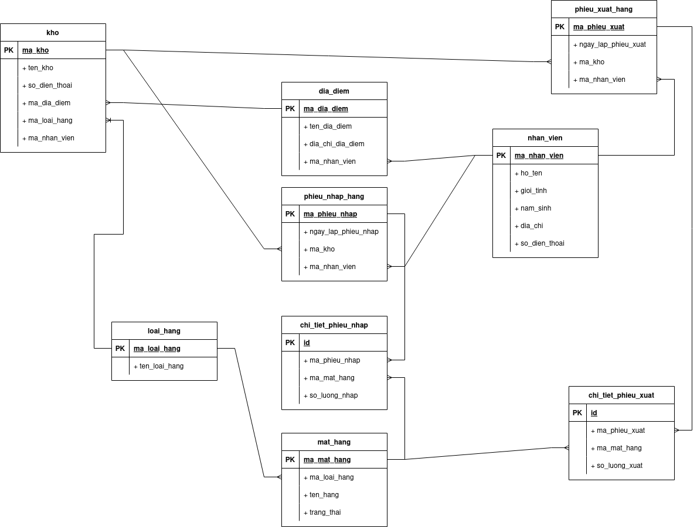
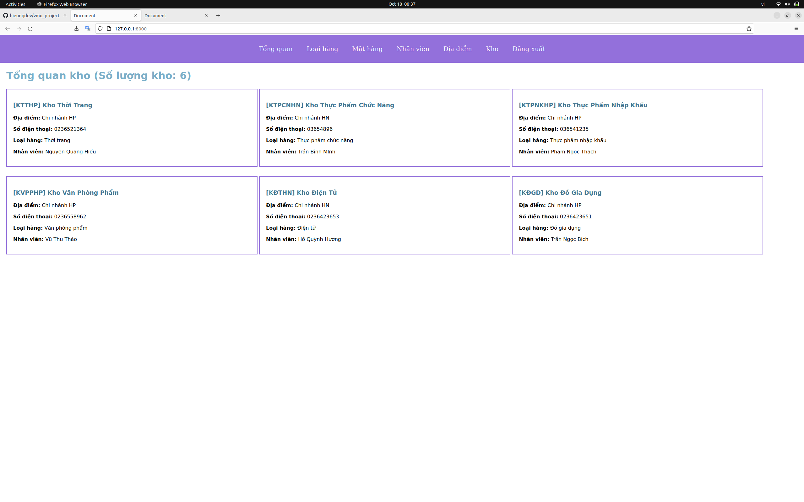
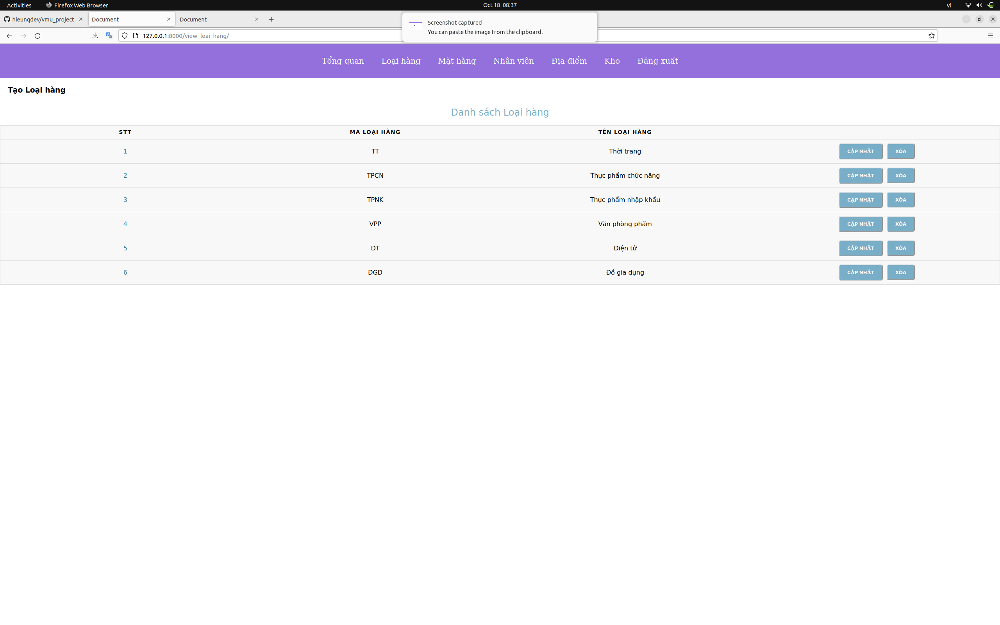
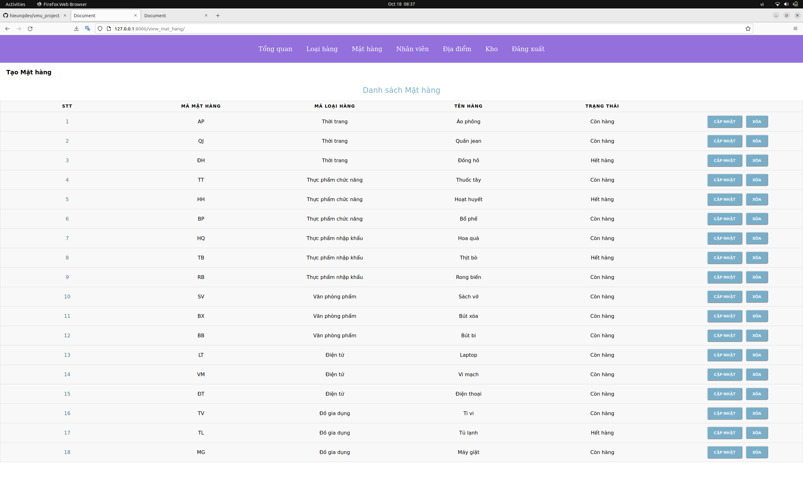
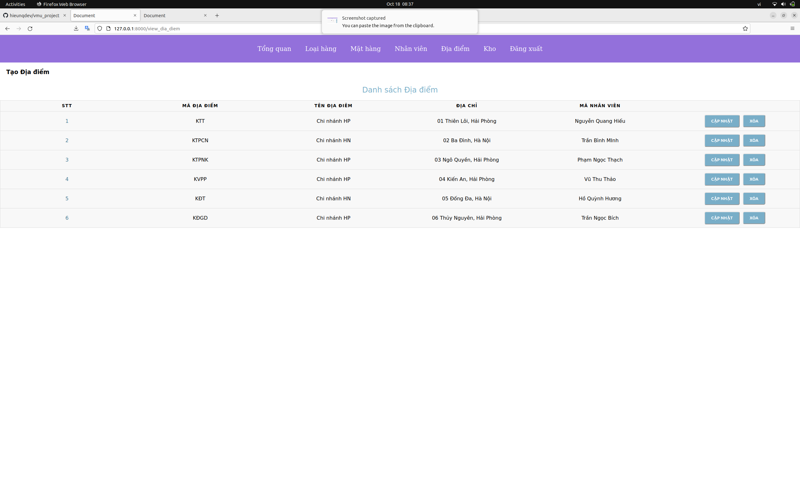
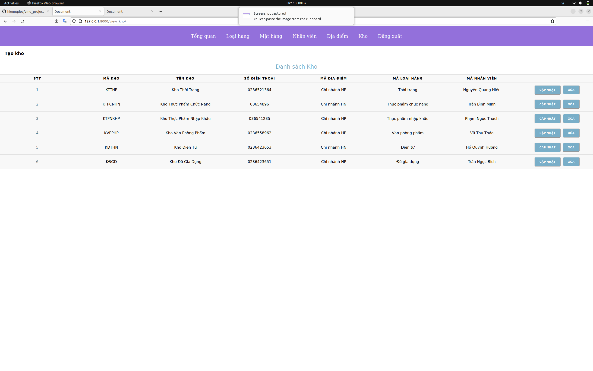

# Warehouse Management
---
warehouse management software

## Diagram of Project
---

## Installation:
---
### 1.Clone the Repo
'''
git clone https://github.com/hieunqdev/warehouse_managerment.git
'''
### 2.Setup venv & Install Requirements
'''
python3 -m venv venv
source venv/bin/activate
pip install -r requirements.txt
'''
### 3.Migrate Database
'''
python manage.py makemigrations 
python manage.py migrate
'''
### 4.Start Server
'''
python manage.py runserver
'''

## Screenshots
---

